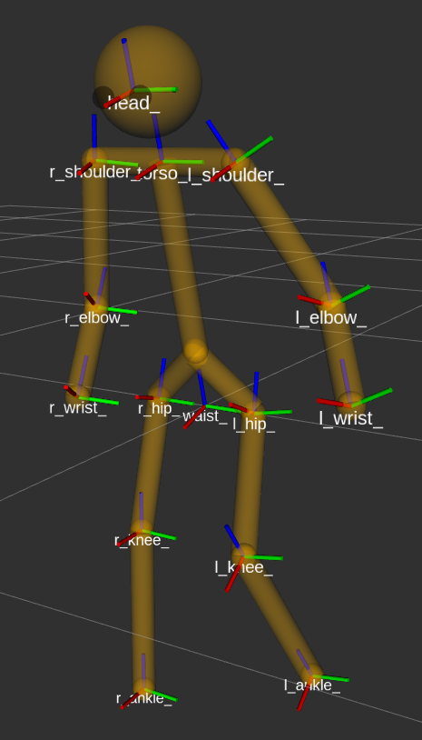

# human_description

Parametric kinematic model of humans, in URDF format, for usage in robotics and HRI

Part of the [ROS4HRI](https://wiki.ros.org/hri) project.

## Testing

Install the package, and launch `ros2 launch human_description show.launch.py`.
This will display the human model, as well as a GUI to control the human joint
state (you might need to install `joint_state_publisher_gui` on your system if
not yet available).

The script `script/create_human_urdf.py` can also be used to generate a URDF
model from the template, showcasing the different parameters that can be
configured.
